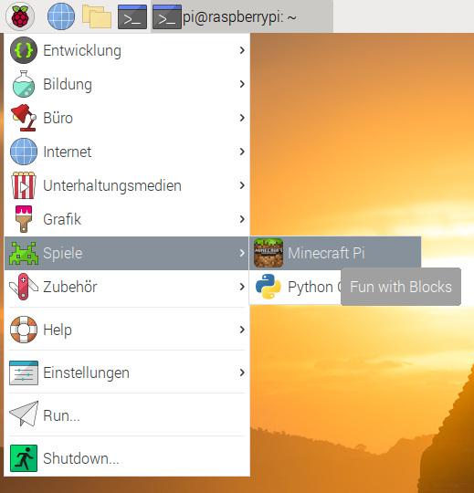

## Minecraft starten

Um Minecraft Pi auszuführen, öffne es über das Desktop-Menü oder gib `minecraft-pi` in das Terminal ein.

Wenn Minecraft Pi geladen wurde, klicke auf **Start Game** (englisch für "Spiel starten"), und dann auf **Create new** (also "neue Erstellen"). Du wirst feststellen, dass das umgebende Fenster leicht versetzt ist. Das bedeutet, dass du zum Ziehen des Fensters die Titelleiste hinter dem Minecraft-Fenster greifen musst.

Du bist jetzt in einem Minecraft-Spiel! Lauf herum, hacke Dinge und baue Dinge!

Schaue dich mit der Maus um und verwende die folgenden Tasten auf der Tastatur:

|       Taste        |        Aktion        |
|:------------------:|:--------------------:|
|         W          |       Vorwärts       |
|         A          |        Links         |
|         S          |      Rückwärts       |
|         D          |        Rechts        |
|         E          |       Inventar       |
|     Leertaste      |       Springen       |
| Doppelte Leertaste |   Fliegen / Fallen   |
|        Esc         |  Pause / Spielmenü   |
|        Tab         | Mauszeiger freigeben |

Du kannst einen Gegenstand mit dem Mausrad aus der Schnellzugriffs-Leiste auswählen (oder die Zahlen auf deiner Tastatur verwenden) oder `E` drücken und etwas aus dem Inventar auswählen.

Du kannst auch zweimal auf die Leertaste tippen, um in die Luft zu fliegen. Du hörst auf zu fliegen, wenn du die Leertaste loslässt und wenn du erneut zweimal darauf tippst, fällst du auf den Boden zurück.

Mit dem Schwert in der Hand kannst du auf Blöcke vor dir klicken, um sie zu entfernen (oder zu graben). Mit einem Block in der Hand kannst du diesen Block mit der rechten Maustaste vor dir platzieren oder mit der linken Maustaste einen Block entfernen.