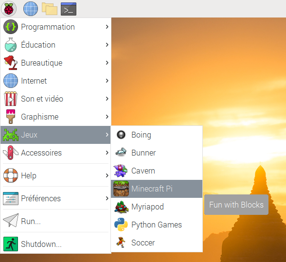

## Lancer et utiliser Minecraft

### Liste de contrôle d'activité

+ Lancez Minecraft à partir du menu ou bien tapez `minecraft-pi` dans le terminal.

+ Une fois Minecraft lancé, cliquez sur __Start Game__, suivi de __Create New__.

(Dans certains cas, il se peut que la fenêtre apparaisse légèrement décalée par rapport à l'affichage du jeu. Cela veut dire que pour déplacer la fenêtre, vous devez attraper la barre de titre derrière l'affichage du jeu.)

Vous êtes maintenant dans une partie de Minecraft! Promenez-vous, modifiez et construisez des choses!

+ Utilisez la souris pour regarder autour de vous et utilisez les touches suivantes du clavier:

Touche | Action
----|-------
W | Déplacement avant
A | Déplacement à gauche
S | Déplacement arrière
D | Déplacement à droite
E | Afficher l'inventaire
Espace | Sauter
Double Espace | Voler / Tomber
Esc | Pause / Menu du jeu
Tab | Relâcher le curseur de souris

+ Vous pouvez choisir des items du panneau d'accès rapide situé au bas de la fenêtre en utilisant la roulette de la souris (ou les chiffres du pavé numérique). Vous pouvez presser `E` et choisir un item de votre inventaire complet.

+ Vous pouvez presser deux fois la barre d'espace pour voler dans les airs. Vous arrêterez de monter en relâchant la barre d'espace et retomberez au sol si vous la pressez deux fois à nouveau.

+ Avec l'épée en main, vous pouvez cliquer sur des blocs devant vous pour les enlever (ou creuser). Avec un bloc en main, vous pouvez utiliser le clic droit pour placer le bloc devant vous ou le clic gauche pour enlever un bloc.