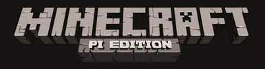

## Začíname s Minecraft Pi

Minecraft je populárna stavebná hra s otvoreným svetom. Bezplatná verzia Minecraft-u je k dispozícii pre Raspberry Pi; je tiež dodávaná s programovateľným rozhraním. To znamená, že môžete písať príkazy a skripty v jazyku Python, aby ste v hre automaticky vytvárali veci. Je to skvelý spôsob, ako sa naučiť Python!

