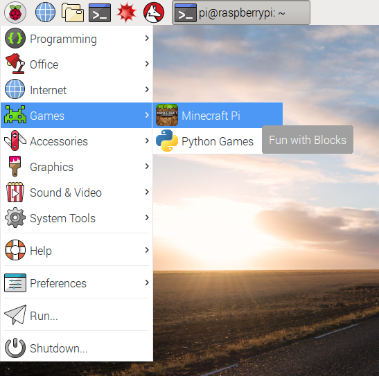

## Spustite Minecraft

Ak chcete spustiť aplikáciu Minecraft, otvoríte ju z hlavného menu alebo zadajte do terminálu príkaz `minecraft-pi`.

Keď sa Minecraft Pi spustí, kliknite na **Start Game** a následne na **Create new**. Všimnete si, že príslušné okno je mierne posunuté. To znamená, že ak chcete okno presunúť, musíte ho chytiť za titulok okna za oknom aplikácie Minecraft.

Teraz ste v hre Minecraft! Trochu sa prejdite, hackujte a stavajte nové veci!

Pomocou myši sa môžete rozhliadnuť okolo seba a pomocou nasledujúcich kláves môžete:

|      Kláves      |       Činnosť        |
|:----------------:|:--------------------:|
|        W         |       Dopredu        |
|        A         |        Vľavo         |
|        S         |        Dozadu        |
|        D         |        Vpravo        |
|        E         |       Inventár       |
|     priestor     |         Jump         |
| Dvojitý priestor |      Fly / Fall      |
|       Esc        |     Pauza / Hra      |
|      pútko       | Uvoľnite kurzor myši |

Môžete vybrať položku z rýchleho kreslenia pomocou rolovacieho kolieska myši (alebo použiť čísla na klávesnici), alebo stlačte `E` a vyberte niečo z inventára.

Dvojitým klepnutím na medzerník môžete lietať do vzduchu. Keď uvoľníte medzerník, prestanete lietať. Ak ho dvakrát klepnete, spadnete späť na zem.

S mečom v ruke môžete kliknúť na bloky pred sebou, aby ste ich odstránili (alebo vykopali). Pomocou bloku v ruke môžete kliknutím pravým tlačidlom myši umiestniť tento blok pred vás alebo kliknutím ľavým tlačidlom odstrániť blok.