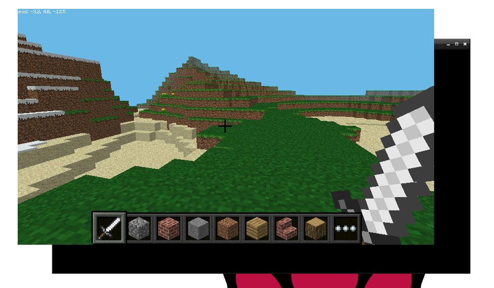

## Spustite Minecraft

Ak chcete spustiť službu Minecraft Pi, otvorte ju z ponuky pracovnej plochy alebo zadajte do terminálu položku `minecraft-pi`.

Keď Minecraft Pi naloží, kliknite na **Spustiť hru**, potom **Vytvoriť nové**. Všimnete si, že okno s obsahom je mierne posunuté. To znamená pretiahnuť okno okolo vás musí chytiť titulku za oknom Minecraft.

Teraz ste v hre Minecraft! Ísť chodiť, hack veci, a stavať veci!

Pomocou myši sa pozrite a použite nasledujúce klávesy na klávesnici:

|       kľúč       |        akčné         |
|:----------------:|:--------------------:|
|        W         |        vpred         |
|        A         |         ľavý         |
|        S         |       zaostalý       |
|        D         |       Správny        |
|        E         |       inventár       |
|     priestor     |         Jump         |
| Dvojitý priestor |      Fly / Fall      |
|       Esc        |     Pauza / Hra      |
|      pútko       | Uvoľnite kurzor myši |

Môžete vybrať položku z rýchleho kreslenia pomocou rolovacieho kolieska myši (alebo použiť čísla na klávesnici), alebo stlačte `E` a vyberte niečo z inventára.

Dvojitým klepnutím na medzerník môžete lietať do vzduchu. Keď uvoľníte medzerník, prestanete lietať. Ak ho dvakrát klepnete, spadnete späť na zem.

S mečom v ruke môžete kliknúť na bloky pred sebou, aby ste ich odstránili (alebo vykopali). Pomocou bloku v ruke môžete kliknutím pravým tlačidlom myši umiestniť tento blok pred vás alebo kliknutím ľavým tlačidlom odstrániť blok.