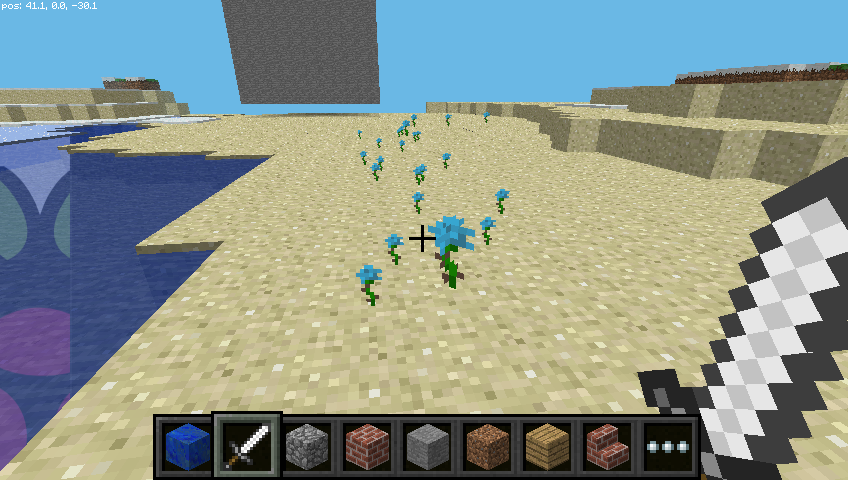

## Kladenie blokov počas chôdze

Teraz viete, ako padnúť bloky, poďme používať našu pohyblivú polohu na to, aby sme zablokovali bloky, keď chodíte.

Nasledujúci kód zní za kvetom za kýmkoľvek, kam idete:

```python
from mcpi.minecraft import Minecraft
from time import sleep

mc = Minecraft.create()

flower = 38

while True:
    x, y, z = mc.player.getPos()
    mc.setBlock(x, y, z, flower)
    sleep(0.1)
```

Teraz choďte na chvíľu dopredu a otočte sa, aby ste videli kvety, ktoré ste nechali za sebou.



Vzhľadom k tomu, že sme použili `zatiaľ čo True` slučka to bude pokračovať navždy. Ak ho chcete zastaviť, stlačte `Ctrl + C` v okne Python.

Skúste lietanie vzduchom a pozrite sa na kvety, ktoré opúšťate na oblohe:


Čo keď sme chceli kvapkať len kvety, keď hráč prechádzal trávou? Môžeme použiť `getBlock` a zistiť, aký typ bloku je:

```python
x, y, z = mc.player.getPos()  # player position (x, y, z)
this_block = mc.getBlock(x, y, z)  # block ID
print(this_block)
```

Toto informuje o umiestnení bloku, ktorý stojíte *na* (to bude `0` - vzduchový blok). Chceme vedieť, aký typ bloku stojíme *na*. Preto odčítame 1 z hodnoty `y` a pomocou `getBlock ()` zistite, aký typ bloku stojíme:

```python
x, y, z = mc.player.getPos()  # player position (x, y, z)
block_beneath = mc.getBlock(x, y-1, z)  # block ID
print(block_beneath)
```

Toto nám hovorí o ID bloku, na ktorom je prehrávač.

Otestujte to tak, že spustite slučku a vytlačte ID bloku toho, na čom práve stojíte:

```python
while True:
    x, y, z = mc.player.getPos()
    block_beneath = mc.getBlock(x, y-1, z)
    print(block_beneath)
```


Môžeme použiť vyhlásenie `if` aby sme si vybrali, či rastlinu budeme alebo nie:

```python
grass = 2
flower = 38

while True:
    x, y, z = mc.player.getPos()  # player position (x, y, z)
    block_beneath = mc.getBlock(x, y-1, z)  # block ID

    if block_beneath == grass:
        mc.setBlock(x, y, z, flower)
    sleep(0.1)
```

Možno by sme mohli obrátiť dlaždice, na ktorej stojíme, na trávu, ak už nie je tráva:

```python
if block_beneath == grass:
    mc.setBlock(x, y, z, flower)
else:
    mc.setBlock(x, y-1, z, grass)
```

Teraz môžeme kráčať dopredu a ak ideme na tráve, opustíme kvet. Ak ďalší blok nie je tráva, premenuje sa na trávu. Keď sa obrátime a ideme späť, necháme za sebou kvety.

