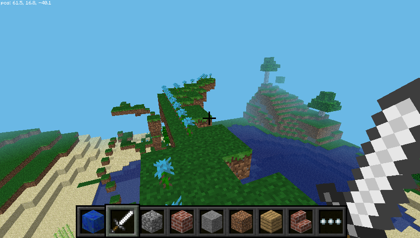

## Kladenie blokov počas chôdze

Keď už viete, ako klásť bloky, poďme využiť zmenu našej polohy tak, aby sme mohli bloky klásť počas chôdze.

Nasledujúci kód bude za vás klásť kvietky kamkoľvek pôjdete:

```python
from mcpi.minecraft import Minecraft
from time import sleep

mc = Minecraft.create()

flower = 38

while True:
    x, y, z = mc.player.getPos()
    mc.setBlock(x, y, z, flower)
    sleep(0.1)
```

Teraz sa chvíľku poprechádzajte a otočte sa za seba, aby ste videli kvietky, ktoré ste za sebou nechali.


Vzhľadom na to, že sme použili cyklus `while True`, bude sa kód vykonávať donekonečna. Ak ho chcete zastaviť, stlačte v okne jazyka Python `Ctrl + C`.

Skúste sa preletieť vzduchom a sledujte kvietky, ktoré za sebou na oblohe zanechávate:


Čo ak by sme chceli kvietky klásť len vtedy, ak sa hráč bude pohybovať po tráve? Na zistenie typu bloku môžeme použiť funkciu `getBlock`:

```python
x, y, z = mc.player.getPos()  # pozicia hraca (x, y, z)
this_block = mc.getBlock(x, y, z)  # ID bloku
print(this_block)
```

Toto informuje o umiestnení bloku, ktorý stojíte *na* (to bude `0` - vzduchový blok). Chceme vedieť, aký typ bloku stojíme *na*. Preto odčítame 1 z hodnoty `y` a pomocou `getBlock ()` zistite, aký typ bloku stojíme:

```python
x, y, z = mc.player.getPos()  # player position (x, y, z)
block_beneath = mc.getBlock(x, y-1, z)  # block ID
print(block_beneath)
```

Toto nám hovorí o ID bloku, na ktorom je prehrávač.

Otestujte to tak, že spustite slučku a vytlačte ID bloku toho, na čom práve stojíte:

```python
while True:
    x, y, z = mc.player.getPos()
    block_beneath = mc.getBlock(x, y-1, z)
    print(block_beneath)
```


Môžeme použiť vyhlásenie `if` aby sme si vybrali, či rastlinu budeme alebo nie:

```python
grass = 2
flower = 38

while True:
    x, y, z = mc.player.getPos()  # player position (x, y, z)
    block_beneath = mc.getBlock(x, y-1, z)  # block ID

    if block_beneath == grass:
        mc.setBlock(x, y, z, flower)
    sleep(0.1)
```

Možno by sme mohli obrátiť dlaždice, na ktorej stojíme, na trávu, ak už nie je tráva:

```python
if block_beneath == grass:
    mc.setBlock(x, y, z, flower)
else:
    mc.setBlock(x, y-1, z, grass)
```

Teraz môžeme kráčať dopredu a ak ideme na tráve, opustíme kvet. Ak ďalší blok nie je tráva, premenuje sa na trávu. Keď sa obrátime a ideme späť, necháme za sebou kvety.

