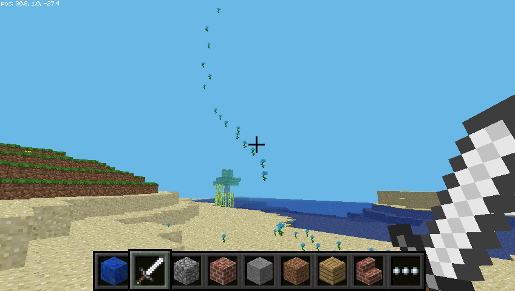

## Pokles blokov počas chodu

Teraz viete, ako padnúť bloky, poďme používať našu pohyblivú polohu na to, aby sme zablokovali bloky, keď chodíte.

Nasledujúci kód zní za kvetom za kýmkoľvek, kam idete:

```python
z mcpi.minecraft importu Minecraft z času importu spánku mc = Minecraft.create () kvet = 38 zatiaľ čo True: x, y, z = mc.player.getPos () mc.setBlock (x, y, z, 0.1)
```

Teraz choďte na chvíľu dopredu a otočte sa, aby ste videli kvety, ktoré ste nechali za sebou.


Vzhľadom k tomu, že sme použili `zatiaľ čo True` slučka to bude pokračovať navždy. Ak ho chcete zastaviť, stlačte `Ctrl + C` v okne Python.

Skúste lietanie vzduchom a pozrite sa na kvety, ktoré opúšťate na oblohe:



Čo keď sme chceli kvapkať len kvety, keď hráč prechádzal trávou? Môžeme použiť `getBlock` a zistiť, aký typ bloku je:

```python
x, y, z = mc.player.getPos () # pozícia hráča (x, y, z) this_block = mc.getBlock (x, y, z) # block ID print (this_block)
```

Toto informuje o umiestnení bloku, ktorý stojíte *na* (to bude `0` - vzduchový blok). Chceme vedieť, aký typ bloku stojíme *na*. Preto odčítame 1 z hodnoty `y` a pomocou `getBlock ()` zistite, aký typ bloku stojíme:

```python
x, y, z = mc.player.getPos () # pozícia hráča (x, y, z) block_beneath = mc.getBlock (x, y-1, z) # block ID print (block_beneath)
```

Toto nám hovorí o ID bloku, na ktorom je prehrávač.

Otestujte to tak, že spustite slučku a vytlačte ID bloku toho, na čom práve stojíte:

```python
zatiaľ čo pravda: x, y, z = mc.player.getPos () block_beneath = mc.getBlock (x, y-1, z) tlač (block_beneath)
```


Môžeme použiť vyhlásenie `if` aby sme si vybrali, či rastlinu budeme alebo nie:

```python
(x, y, z) block_beneath = mc.getBlock (x, y-1, z) # ID bloku, ak je to pravé: x, y, z = mc.player.getPos block_beneath == tráva: mc.setBlock (x, y, z, kvet) spánok (0,1)
```

Možno by sme mohli obrátiť dlaždice, na ktorej stojíme, na trávu, ak už nie je tráva:

```python
ak block_beneath == tráva: mc.setBlock (x, y, z, kvetina) inak: mc.setBlock (x, y-1, z, tráva)
```

Teraz môžeme kráčať dopredu a ak ideme na tráve, opustíme kvet. Ak ďalší blok nie je tráva, premenuje sa na trávu. Keď sa obrátime a ideme späť, necháme za sebou kvety.

