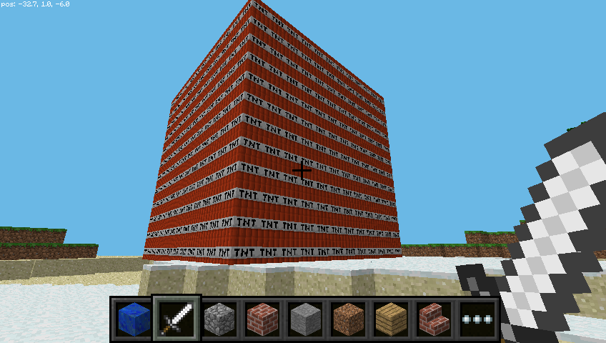

## Zábava s blokmi TNT

Ďalším zaujímavým blokom je TNT! Ak chcete umiestniť normálny blok TNT, použite:

```python
tnt = 46
mc.setBlock(x, y, z, tnt)
```


Tento blok TNT je však dosť nudný. Skúste použiť `data` s hodnotou `1`:

```python
tnt = 46
mc.setBlock(x, y, z, tnt, 1)
```

Teraz použite svoj meč a kliknite ľavým tlačidlom na blok TNT: ten sa aktivuje a za niekoľko sekúnd exploduje!

Teraz sa pokúste vytvoriť veľkú kocku blokov TNT!

```python
tnt = 46
mc.setBlocks(x+1, y+1, z+1, x+11, y+11, z+11, tnt, 1)
```



Teraz uvidíte veľkú kocku plnú blokov TNT. Aktivujte jeden z blokov a následne utečte, aby ste si vychutnali celú show! Renderovanie však bude dosť pomalé, pretože sa naraz mení príliš veľa vecí.

